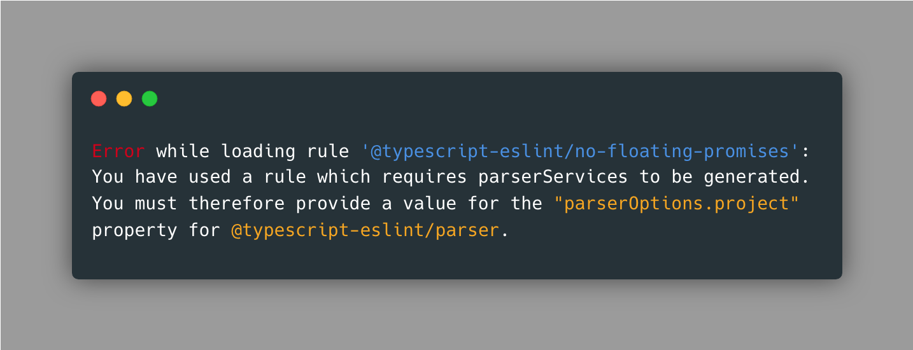

After about one week of enduring ESLint, I have formed a somewhat complicated relationship between the tool and myself. If you couldn't tell by my enthusiasm in that last sentence, it has been rough, to say the least.

## Introduction

For some context, we have been using ESLint in our class as a tool to help write "better" code according to coding standards. The importance of ESLint can be summarized with a quote from [Francisco Moretti](https://www.franciscomoretti.com):  
*"By incorporating ESLint into your development process, you can enforce consistent coding standards, catch potential errors early, and write cleaner, more maintainable JavaScript code."*  

If you want to learn more, check out this great video: 
<iframe width="560" height="315" src="https://www.youtube.com/embed/ZuDIXV94Z1w" title="YouTube video player" frameborder="0" allow="accelerometer; autoplay; clipboard-write; encrypted-media; gyroscope; picture-in-picture" allowfullscreen></iframe>

## Cons

Now that we quickly reviewed what ESLint is all about, I can dive into my experience with the tool. The first thing I, like many others, experienced was the difficult setup. You will have to download multiple separate tools, open various files to configure the app, and initialize/run using various commands.

If you ever get ESLint and its dependencies set up and start coding, you might find yourself faced with numerous errors. ESLint is very restricting with its rules, so much so that I found myself with errors on pieces of code I intentionally wrote for its functionality.

Due to these many errors, it was difficult for me to integrate it into my normal workflow. I was constantly pulled off of my programming "thought train" to address an error I could barely understand. Thankfully, I had my knowledgeable friend ChatGPT there to translate. Regardless, the learning curve for the tool can be overwhelming.

## Pros

Now that you’ve listened to my week-long pent-up rant, I can address the true abilities of ESLint. Tech companies like Airbnb, Facebook, Microsoft, Google, and many more integrate ESLint into their production, and that isn’t by chance.

The most notorious implementation of ESLint has to be error prevention by far. ESLint helps to catch potential issues before the code is run or pushed. It also has many more in-depth error-catching capabilities than what is normally provided.

What works hand-in-hand with error prevention is code consistency. By enforcing coding standards, it ensures that all members of a team are on the same page and follow similar structures. This not only makes it easier for someone trying to learn and understand code written by another member, but also allows for easier maintenance and updates that may happen in the future.

## Conclusion

I’ve spoken about why I may be missing hair on my head due to the many infuriating features, but also touched on the power of those features. Although the setup and learning curve were difficult, ESLint is a powerful tool used in real-world production that is well worth learning in the long run. I plan to continue to grow my relationship with the tool until it becomes a staple part of my tech stack.