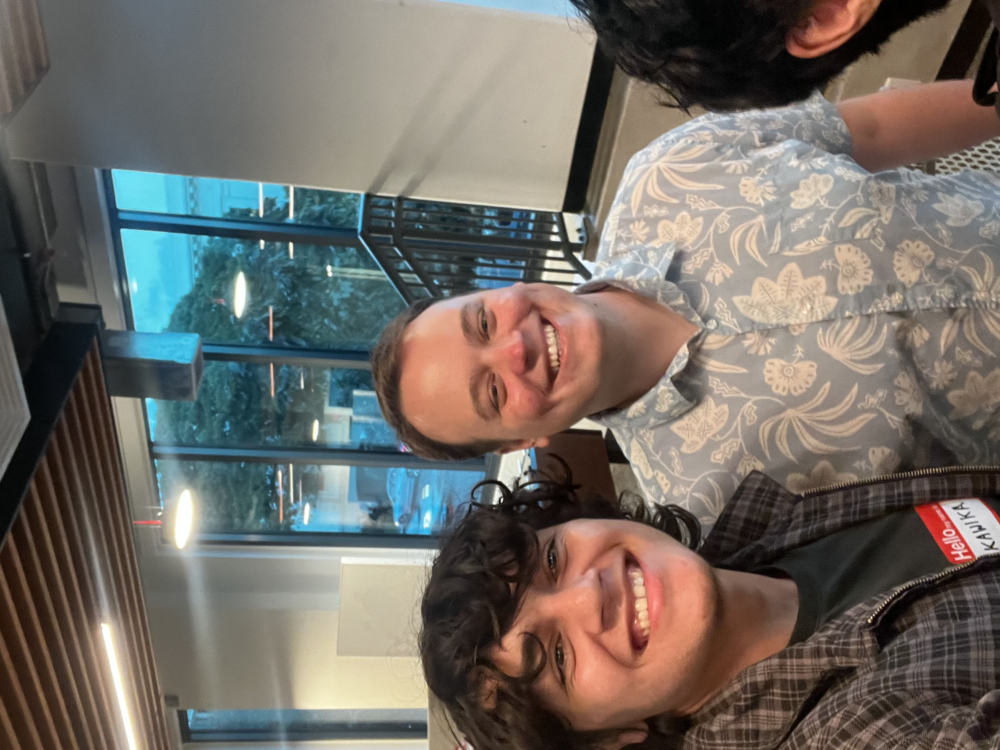

The Tech Mind meetup was a good opportunity to meet with a lot of established members within the tech community. I really valued being able to speak with senior engineers and founders of tech startups especially since I am very interested in entrepreneurship. I was able to speak to numerous guests by rotating on the table in groups. I learned about how to present yourself and things to look out for when leading tech startups. I also enjoyed the free food!

